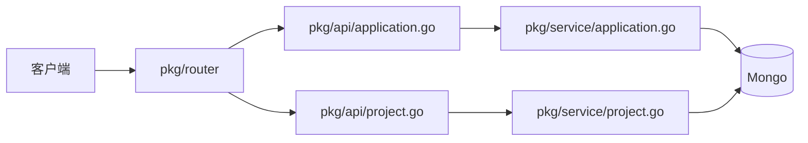

# 架构说明

`devflow-app-service` 是 Devflow 的应用元数据服务，只负责 `Project` 和 `Application`。

## 职责

- 提供 `Project` 的增删改查
- 提供 `Application` 的增删改查
- 维护 `Application.active_manifest` 关联
- 通过 Mongo 持久化应用元数据
- 提供统一的 HTTP 入口、健康检查和 Swagger 文档

## 依赖

- HTTP 层：`Gin`
- 启动与观测基础设施：`../devflow-service-common`
- 数据层：Mongo

## 请求链路

## 不负责的内容

- `Manifest`
- `Release`
- `Intent`
- `Configuration`
- `Verify`
- Tekton、Argo 这类执行面逻辑

## 目录职责

- `cmd/main.go`：进程入口
- `pkg/config/`：配置加载与基础设施初始化
- `pkg/router/`：路由注册
- `pkg/api/`：HTTP handler
- `pkg/service/`：应用业务逻辑
- `pkg/model/`：应用相关模型
- `docs/`：仓库级文档与 Swagger
